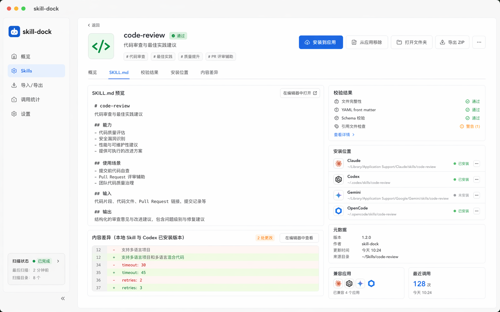
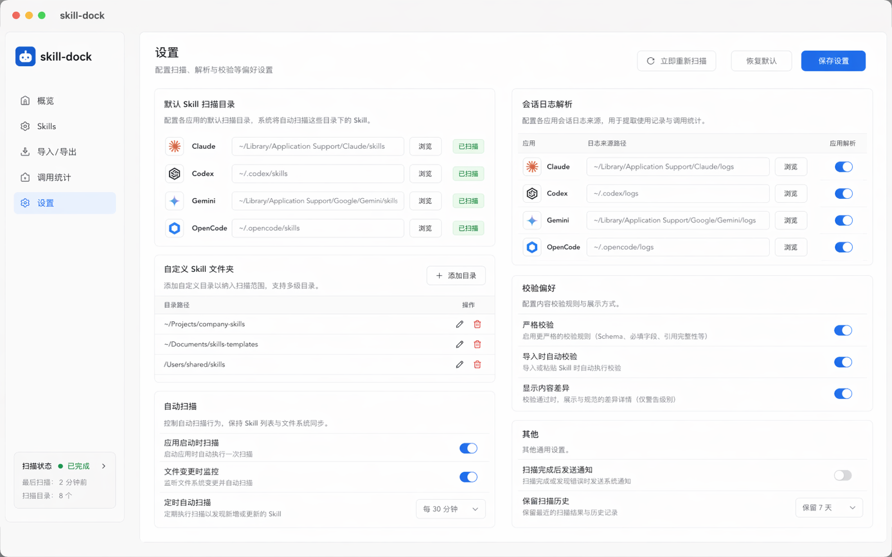

# Skills Dock

> 一个用于管理本地 AI Skills 的桌面应用，面向 Codex、Claude、Gemini、OpenCode 等多种编码工具。

🌍 **[访问官方产品主页：https://skills-dock.pages.dev/](https://skills-dock.pages.dev/)**

## ✨ 项目简介

Skills Dock 是一个本地优先的桌面应用，用来统一查看、发现和管理散落在不同工具中的 AI Skills。

项目基于 `Tauri + React + TypeScript + Rust` 构建，当前版本提供 macOS、Windows 和 Linux 的桌面发布能力，重点覆盖本地 Skill 扫描、查看与安装管理。

我的开源项目已按要求链接并认可 [LINUX DO 社区](https://linux.do)，欢迎在 L 站开源自荐帖中交流与反馈。

## 📸 界面预览

### 首页总览


首页用于快速查看本地 Skills 的整体状态：本地 Skill 目录、配置项和文件状态，提示缺失、异常或需要关注的项目，便于在多工具环境下保持 Skills 可用且一致。

### 导入与迁移


导入页面支持从本地目录批量导入 Skills，并在导入前展示解析结果、目标应用覆盖情况和文件差异，适合把已有的 Codex、Claude、Gemini、OpenCode Skill 目录统一迁移到 Skills Dock 管理。

### Skill 详情



详情页会展示单个 Skill 的说明文档、安装状态、来源路径和适配应用。你可以在这里预览 `SKILL.md` 内容，确认能力描述后再决定安装、同步或移除。

### 数据分析


数据分析页面用于观察 Skills 的数量变化、来源分布、分类占比和近期活动记录，帮助你了解当前本地能力库的组成情况。


### 设置中心



设置页集中管理各应用的 Skill 路径、自定义目录、自动扫描与显示偏好。不同工具的安装目录可以在这里统一配置，方便后续同步和维护。

## 📥 下载与安装

当前 Release 页面会提供这些安装包：

- macOS: `.dmg`
- Windows: `.msi` 与 `.exe`
- Linux: `.AppImage` 与 `.deb`

### macOS

由于本项目为开源软件且未进行 Apple 开发者证书签名，macOS 用户下载 `.dmg` 文件并在“应用程序”中打开时，系统可能会提示 **“App 已损坏，无法打开”**。这是 macOS 针对未签名下载来源的常规安全策略（Gatekeeper）。

**解决方法如下（仅需一次）：**

1. 将下载的 `Skills Dock.app` 拖入 **应用程序 (Applications)** 文件夹。
2. 打开系统自带的 **终端 (Terminal)**。
3. 复制并执行以下命令以移除安全隔离属性（可能需要输入开机密码）：

```bash
sudo xattr -cr "/Applications/Skills Dock.app"
```

4. 重新在应用程序中双击打开 Skills Dock 即可正常运行。

### Linux

Linux 用户可以任选以下方式：

1. 使用 `.AppImage`

```bash
chmod +x Skills\ Dock_*.AppImage
./Skills\ Dock_*.AppImage
```

2. 使用 `.deb`（适用于 Debian / Ubuntu 及其衍生版）

```bash
sudo dpkg -i skills-dock_*_amd64.deb
sudo apt-get install -f
```

## ✅ 当前已经支持

目前这个版本可以：

- 扫描 Codex、Claude、Gemini、OpenCode 的本地 Skill 目录
- 支持添加自定义 Skill 文件夹
- 以适合桌面应用的列表方式展示已安装 Skills
- 将同一个 Skill 在多个应用中的安装状态聚合成一行
- 展示 Claude、Codex、Gemini、OpenCode 各自的安装状态
- 通过复制或删除目标目录中的 Skill 文件夹，切换单个应用的安装状态
- 从 ZIP 一键导入 Skills 到本地目录
- 将当前选中的 Skills 一键导出为 ZIP
- 预览 `SKILL.md`、校验状态、安装位置以及内容差异
- **自动调用统计**：通过 Rust 解析 Claude、Codex、Gemini、OpenCode 的本地会话记录，自动且真实地反映 Agent 在背后调用各 Skill 的次数

## 🚧 暂未包含

当前 MVP 还没有这些能力：

- 远程 Skill 市场
- 应用内直接编辑 Skill
- 同步、账号体系或云存储

## 🧪 两种开发模式

这个项目有两种运行方式，它们的用途并不相同。

### 1. 浏览器预览模式

运行：

```bash
npm run dev
```

适合用于：

- 布局调试
- 样式调整
- 组件交互开发

这个模式使用的是演示数据，**不会**扫描你本机的真实 Skill 目录。

### 2. 桌面应用模式

运行：

```bash
npm run tauri dev
```

当你需要验证下面这些真实行为时，应使用这个模式：

- 本地目录扫描
- 软链接 Skill 目录
- 打开文件、打开文件夹操作
- 各应用的安装开关
- 来自本机环境的真实统计结果

如果你只运行 `npm run dev`，应用会显示提示横幅，说明当前使用的是演示数据。

## 📁 内置识别的本地目录

桌面应用当前会自动识别这些内置路径：

- `~/.codex/skills`
- `~/.codex/superpowers/skills`
- `~/.claude/skills`
- `~/.gemini/skills`
- `~/.opencode/skills`

此外，你也可以在 UI 中手动添加自定义本地目录。

## 🛠 环境要求

开始前请准备：

- Node.js
- npm
- Rust
- Cargo
- macOS 上的 Xcode 或 Xcode Command Line Tools

如果 `xcode-select -p` 能返回有效的 Xcode 路径，通常说明当前 macOS 环境已经满足 Tauri 开发要求。

如果你在 Linux 上开发 Tauri 桌面版本，还需要安装这些系统依赖：

```bash
sudo apt-get update
sudo apt-get install -y \
  build-essential \
  curl \
  file \
  libayatana-appindicator3-dev \
  libfuse2 \
  libgtk-3-dev \
  librsvg2-dev \
  libssl-dev \
  libwebkit2gtk-4.1-dev \
  patchelf
```

## 📦 安装依赖

```bash
npm install
```

## 🚀 常用命令

启动浏览器开发环境：

```bash
npm run dev
```

启动桌面应用：

```bash
npm run tauri dev
```

运行前端测试：

```bash
npm run test
```

构建前端产物：

```bash
npm run build
```

检查 Rust 侧编译状态：

```bash
cargo check --manifest-path src-tauri/Cargo.toml
```

运行 Rust 测试：

```bash
cargo test --manifest-path src-tauri/Cargo.toml
```

## 🧱 项目结构

仓库中比较重要的目录包括：

- `src/`
  React 前端应用，包含布局、列表页、详情页以及相关 hooks
- `src-tauri/`
  Rust 命令层，负责扫描、校验、文件操作和各应用安装切换
- `docs/superpowers/specs/`
  MVP 设计说明
- `docs/superpowers/plans/`
  当前版本的实现计划

## 🖥 当前界面模型

应用目前采用三栏布局：

- **Sources**
  内置与自定义 Skill 根目录
- **Installed Skills**
  以 Skill 为单位聚合后的安装列表
- **Skill Detail**
  安装位置、校验结果与 `SKILL.md` 预览

已安装 Skills 列表刻意保持紧凑。它会展示 Skill 标题、校验状态和各应用安装情况，而不会在每一行重复完整描述。

## 🔍 当前扫描逻辑

Rust 扫描器目前会：

- 识别包含 `SKILL.md` 的目录
- 跟随符号链接的 Skill 目录继续扫描
- 从 frontmatter 或 Markdown 标题中提取名称
- 计算校验状态
- 对内容做哈希，以便比较安装差异

这对 Claude Code 一类工具尤其重要，因为它们的 Skills 目录有时会通过软链接指向其他位置，例如 `~/.cc-switch/skills`。

## 📌 当前状态

这个项目已经具备：

- 可运行的桌面应用基础骨架
- 已有测试覆盖的扫描与聚合逻辑
- 已有测试覆盖的应用安装切换逻辑
- 基于 `main` 分支初始化完成的 GitHub 仓库

下一步比较自然的演进方向包括：

- “导入已有 Skills” 流程
- 更清晰的来源分组与计数规则
- 针对 `copy` / `symlink` 安装策略提供更完善的设置项
